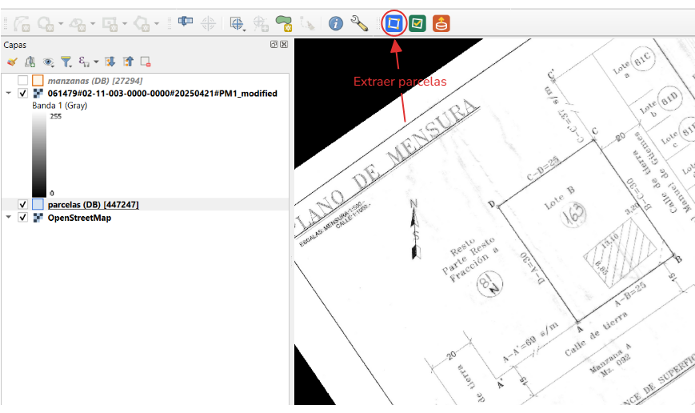
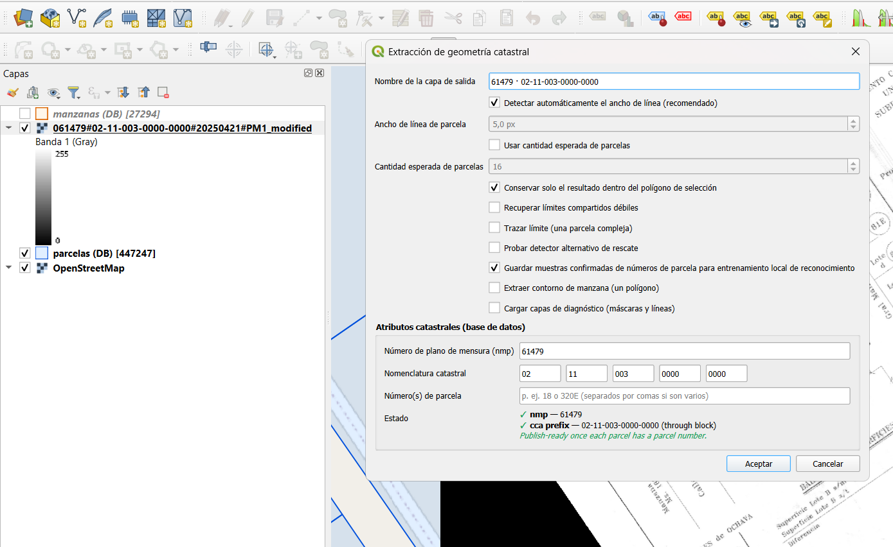
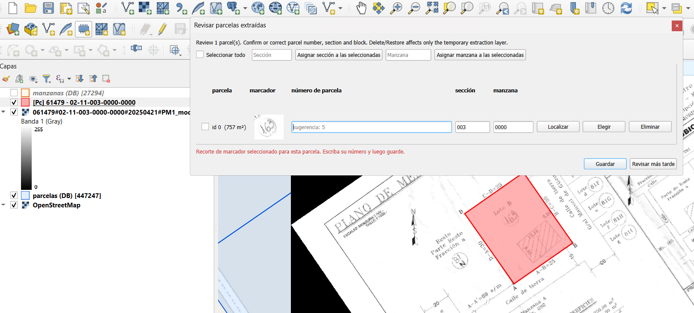
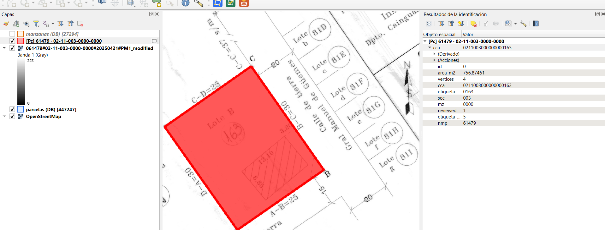
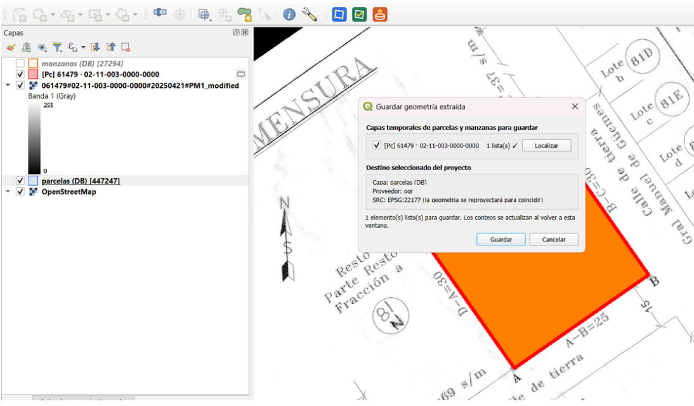

# Relex Geoplan

Complemento de QGIS para extraer parcelas y contornos de manzana desde planos de
mensura georreferenciados en formato TIFF. Todo el procesamiento es **local**: las
imágenes nunca se suben a la nube.

A diferencia de un vectorizador genérico de rásters, Relex Geoplan está pensado para
planos catastrales: reconstruye parcelas adyacentes con **límites compartidos**
(buscando conservar una topología coincidente y evitar huecos o superposiciones) y lee
localmente los números de parcela para reconstruir el código catastral.

## Características

- Extracción de una parcela o de varias **parcelas adyacentes** con límites compartidos.
- Extracción del **contorno de manzana** como un único polígono.
- **Lectura local de etiquetas** (números de parcela) con un conjunto de redes neuronales incluido:
  sugiere el número con alta confianza y el usuario confirma.
- Reconstrucción del código catastral (`cca`) a partir de la nomenclatura.
- Flujo de **revisión** por parcela y **publicación** a una capa vectorial de destino.
- Detección automática del ancho de línea, con opciones para límites débiles, tiras de
  parcelas y parcelas complejas.

## Requisitos

- QGIS 3.22 o posterior.
- Dependencias de Python: `scipy`, `shapely` y `opencv-contrib-python-headless`
  (QGIS ya incluye NumPy). Si falta alguna, el complemento muestra el comando exacto de
  instalación al ejecutarse.
- El plano debe ser un **TIFF georreferenciado**, legible por GDAL (no capas
  XYZ/basemap).

## Instalación

1. Comprimir la carpeta `relex_geoplan` como archivo ZIP. Dentro del ZIP,
   `relex_geoplan/metadata.txt` debe quedar en ese nivel, sin una carpeta adicional.
2. Abrir QGIS y elegir **Complementos > Administrar e instalar complementos**.
3. En **Instalar desde ZIP**, seleccionar `relex_geoplan.zip`.
4. Activar **Relex Geoplan**.

## Uso rápido

Cinco pasos para extraer, revisar y publicar geometría.

### 1. Cargar el plano y extraer

Se debe cargar el TIFF georreferenciado, seleccionarlo en el panel de **Capas** y hacer
clic en **Extraer parcela(s)** en la barra **Relex Geoplan**.

### 2. Configurar la extracción

El ancho de línea se detecta automáticamente. Se completa la nomenclatura catastral y los
números de parcela, y se activan las opciones necesarias (cantidad esperada de parcelas,
recuperar límites débiles, contorno de manzana).

### 3. Dibujar el área

Clic izquierdo agrega cada vértice; clic derecho finaliza (mínimo 3 vértices) e inicia
la extracción. El resultado son capas temporales `[Pc]` (parcelas) o `[Mz]` (manzanas).

### 4. Revisar

Para parcelas, se confirman `etiqueta`, `sección` y `manzana` en **Revisar parcelas
extraídas**. Para una manzana, se selecciona la capa `[Mz]` y se usa **Revisar geometría
extraída** para confirmar su nomenclatura. Al guardar, la revisión se aplica sobre la capa
temporal (se marca `reviewed`); todavía no se publica la geometría.

### 5. Actualizar Parcelario

Con las capas temporales ya revisadas, se selecciona en el panel de **Capas** la capa
parcelaria de destino del proyecto y se hace clic en **Guardar geometría extraída en la
capa seleccionada**. En el diálogo se eligen las capas `[Pc]` o `[Mz]` que correspondan al
destino y se confirma: el complemento reproyecta la geometría al SRC de la capa de destino
y **agrega** las entidades. Requiere que cada parcela tenga su número (`etiqueta`) y un
`cca` completo.

> **Importante:** las capas de parcelas y manzanas de destino comparten los campos
> `cca` y `etiqueta`, por lo que el complemento no puede distinguirlas. El usuario debe
> elegir `[Pc]` para un destino de parcelas o `[Mz]` para un destino de manzanas. La
> publicación es **solo-agregar**: no reemplaza ni elimina geometrías existentes.

## Limitaciones conocidas

- Los planos con **tramas o rayados densos (hatching)** pueden requerir edición manual
  del resultado.
- Los **límites compartidos débiles** pueden necesitar la opción *Recuperar límites
  compartidos débiles* o *Probar detector alternativo de rescate*.
- Los planos de baja calidad o mal georreferenciados dan peores resultados.
- El lector de etiquetas prioriza **no equivocarse**: sugiere solo con alta confianza y
  deja el resto en blanco para que el usuario lo complete.
- La publicación es **solo-agregar**: no busca duplicados ni reemplaza geometrías; el
  usuario elimina manualmente en QGIS lo que quiera reemplazar.

## Privacidad y datos

- Todo el procesamiento ocurre **en tu equipo**. Las imágenes, la geometría y los datos
  catastrales **no se envían a ningún servidor**.
- La opción de recolectar muestras confirmadas para mejorar el reconocimiento guarda
  recortes **localmente** en la carpeta del proyecto (`<proyecto>/etiqueta_harvest`) y
  nunca los sube; desactivarla detiene la recolección pero no borra lo ya guardado.

## Arquitectura

- El núcleo de visión por computadora es **independiente de QGIS** (`core/`): detecta
  líneas, construye un arreglo planar y deriva las caras y los polígonos.
- La lectura de etiquetas usa un **conjunto de redes CNN** incluido en el complemento,
  ejecutado localmente con `cv2.dnn`.
- No hay servicios externos ni llamadas de red.

## Licencia

Copyright © 2026 Relex SRL.

Relex Geoplan se distribuye bajo la licencia [GPL-2.0](LICENSE).

## Soporte

Para reportar problemas o solicitar funcionalidades: contacto@relex.ar
